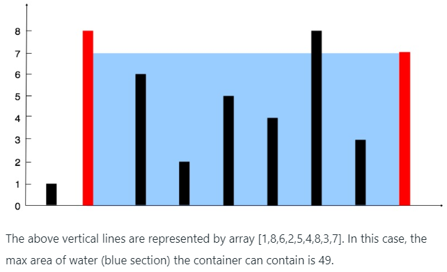

# 描述 
给定n个非负整数a1 a2…，其中每个点表示坐标(i, ai)处的一个点。画出n条垂直线，使得直线i的两个端点在(i, ai)和(i, 0)处。找出两条直线，这两条直线和x轴构成一个容器，使得容器中含有最多的水。

# 方法
使用双指针的概念，首先将两个指针放到数组的两端，考虑最宽的长度，然后找到两个较小的那个数，判断这个数是左边的还是右边的，然后比较这个数和旁边的数的大小（右边比较它左边的邻居，左边比较右边的邻居），为什么比大小呢？因为我们可以看出，如果数的邻居要是比这个数要小，那么这个小的数所占的面积一定小于前面这个数的面积（宽度更小，高度更低），就可以递减寻找数的邻居的邻居。不小的话，相应地平移一个单位，计算区域面积，比较最大区域面积即可。