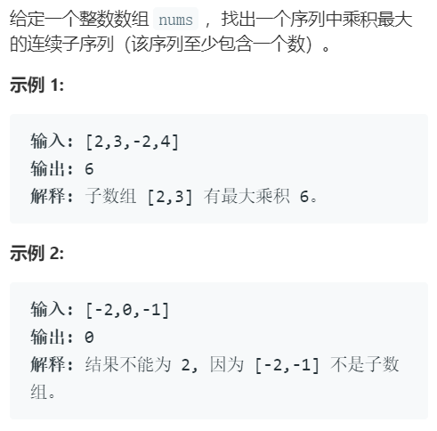

# 问题描述

# 方法

这题的解法主要有动态规划以及双向遍历，动态规划可以参考[链接](https://leetcode.com/problems/maximum-product-subarray/discuss/48230/Possibly-simplest-solution-with-O(n)-time-complexity), 同时记录前一位可能的最大值和最小值，如果当前位为负数，则交换前一位的最大值和最小值（负数会使最大值变更小，更小值变更大），然后与当前位相乘，更新最大最小值。最后更新结果,这种方法类似于第53题的最大求和子序列。

第二种方法很特别，推荐看[链接]的解法二，双向都进行相乘，更新最大值和结果，出现0，最大值置1，最后更新结果。