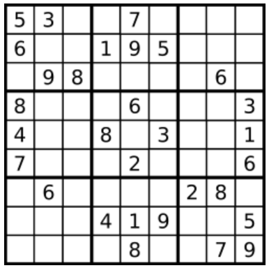

# 问题描述

确定9x9数独板是否有效。只需要根据以下规则验证填充的单元格:

1.每一行必须包含数字1-9，不能重复;

2.每一列必须包含数字1-9，不能重复。

3.网格的9个3x3子框中的每一个都必须包含数字1-9，不能重复



数独板可以部分填充，其中空单元格填充字符'.'。

# 例子

```bash
Input:
[
  ["5","3",".",".","7",".",".",".","."],
  ["6",".",".","1","9","5",".",".","."],
  [".","9","8",".",".",".",".","6","."],
  ["8",".",".",".","6",".",".",".","3"],
  ["4",".",".","8",".","3",".",".","1"],
  ["7",".",".",".","2",".",".",".","6"],
  [".","6",".",".",".",".","2","8","."],
  [".",".",".","4","1","9",".",".","5"],
  [".",".",".",".","8",".",".","7","9"]
]
Output: true

Input:
[
  ["8","3",".",".","7",".",".",".","."],
  ["6",".",".","1","9","5",".",".","."],
  [".","9","8",".",".",".",".","6","."],
  ["8",".",".",".","6",".",".",".","3"],
  ["4",".",".","8",".","3",".",".","1"],
  ["7",".",".",".","2",".",".",".","6"],
  [".","6",".",".",".",".","2","8","."],
  [".",".",".","4","1","9",".",".","5"],
  [".",".",".",".","8",".",".","7","9"]
]
Output: false
Explanation: Same as Example 1, except with the 5 in the top left corner being 
    modified to 8. Since there are two 8 in the top left 3x3 sub-box, it is invalid.

Note
- 数独板(部分填充)可能是有效的，但不一定是可解的。
- 只需要根据上述规则验证填充的单元格。
- 给定的板只包含数字1-9和字符'.'
- 给定的板大小总是9x9
```

# 方法

代码中给定的方法是基于哈希表的，方法很巧妙，来自于https://leetcode.com/problems/valid-sudoku/discuss/15472/Short%2BSimple-Java-using-Strings

```python
class Solution:
    def isValidSudoku(self, board: List[List[str]]) -> bool:
        _dict = dict()
        for i in range(9):
            for j in range(9):
                if board[i][j] != '.':
                    #利用位置关系构造独特的键值，很是巧妙
                    b = '(' + board[i][j] + ')'
                    if _dict.get(str(i) + b, 0) or \
                       _dict.get(b + str(j), 0) or \
                       _dict.get(str(i // 3) + b + str(j // 3), 0):
                        return False
                    else:
                        _dict[str(i) + b] = 1
                        _dict[b + str(j)] = 1
                        _dict[str(i // 3) + b + str(j // 3)] = 1
        return True
```

另外一种是基于位运算，也非常巧妙, 没有数组有有个数，每个数代表一行或一列或一个backet，每个数是int，每一位代表当前行是否出现此数，出现即置1，重复出现条件判断为真，返回false, 来自https://leetcode.com/problems/valid-sudoku/discuss/15560/Yet-another-java-2ms-solution。
```java
public boolean isValidSudoku(char[][] board) {
    int [] vset = new int [9]; 
    int [] hset = new int [9];
    int [] bckt = new int [9];
    int idx = 0;
    for (int i = 0; i < 9; i++) {
        for (int j = 0; j < 9; j++) {
            if (board[i][j] != '.') {
                idx = 1 << (board[i][j] - '0') ;
                if ((hset[i] & idx) > 0 ||
                    (vset[j] & idx) > 0 ||
                    (bckt[(i / 3) * 3 + j / 3] & idx) > 0) return false;
                hset[i] |= idx;
                vset[j] |= idx;
                bckt[(i / 3) * 3 + j / 3] |= idx;
            }
        }
    }
    return true;
}
```