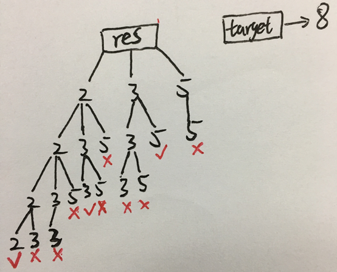

# 问题描述

给定一组候选编号(没有重复)和一个目标编号(目标)，找出候选编号与目标编号之和的所有唯一组合。

同一重复号码可从候选中无限次选择。

Note:
- 所有的数字(包括目标)都是正整数。
- 解集不能包含重复的组合。

# 例子

```bash
Input: candidates = [2,3,6,7], target = 7,
A solution set is:
[
  [7],
  [2,2,3]
]

Input: candidates = [2,3,5], target = 8,
A solution set is:
[
  [2,2,2,2],
  [2,3,3],
  [3,5]
]
```

# 方法

采用回溯法, 搜索树如下所示，以dfs的方法进行搜索。



```c++
class Solution {
public:
    vector<vector<int>> combinationSum(vector<int>& candidates, int target) {
        vector<vector<int>> res;
        sort(candidates.begin(), candidates.end()); //先排序
        vector<int> combination;
        searchtree(res, candidates, target, combination, 0);
        return res;
    }
    
    void searchtree(vector<vector<int>>& res, vector<int>& candidates, int target, vector<int>& combination, int start){
        if (!target){ // target等于0的时候，搜索到了，push到res中
            res.push_back(combination);
            return;
        }
        // 当target小于candidate[i], 说明当前数字和后面的数字都不能满足条件，因为是有序的vector，所以会退出循环。
        for (int i = start; i < candidates.size() && target >= candidates[i]; ++i){
            //combination 每次push，都会pop_back一次，因为每次搜索新的组合需要空的vector
            combination.push_back(candidates[i]);
            searchtree(res, candidates, target - candidates[i], combination, i);
            combination.pop_back();
        }
    }
};
```