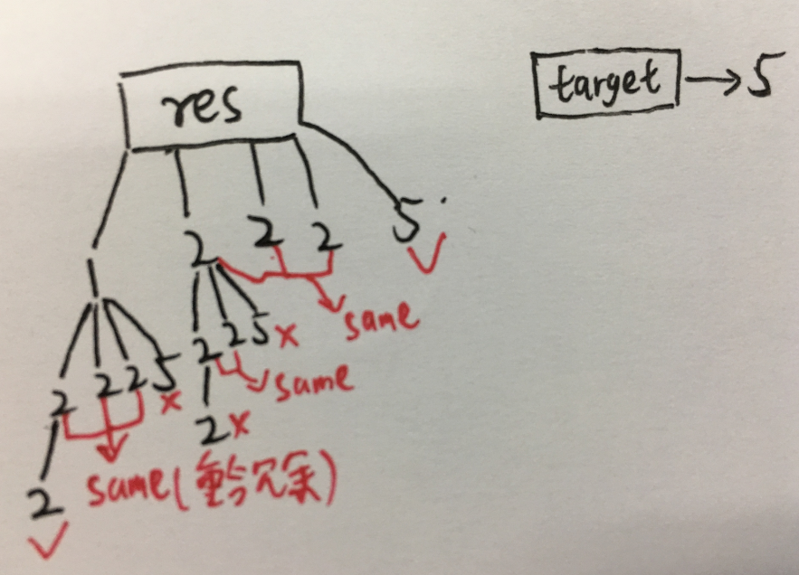

# 问题描述

给定一组候选编号和一个目标编号，找出候选编号之和与目标编号相等的所有唯一组合。候选项中的每个数字只能在组合中使用一次。

候选项中的每个数字只能在组合中使用一次。

Note:
- 所有的数字(包括目标)都是正整数。
- 解集不能包含重复的组合。

# 例子

```bash
Input: candidates = [10,1,2,7,6,1,5], target = 8,
A solution set is:
[
  [1, 7],
  [1, 2, 5],
  [2, 6],
  [1, 1, 6]
]

Input: candidates = [2,5,2,1,2], target = 5,
A solution set is:
[
  [1,2,2],
  [5]
]
```

# 方法

采用回溯法, 搜索树如下所示，以dfs的方法进行搜索。



```c++
class Solution {
public:
    vector<vector<int>> combinationSum2(vector<int>& candidates, int target) {  
        sort(candidates.begin(), candidates.end());
        vector<vector<int>> res;
        vector<int> combination;
        bfs(res, candidates, target, combination, 0);
        return res;
    }
    
    void bfs(vector<vector<int>>& res, vector<int>& candidates, int target, vector<int>& combination, int start){
        if (target < 0) //小于0，返回进行回溯。
            return;
        if (target == 0){
            res.push_back(combination); //等于0，push到res中，返回回溯
            return;
        }
        for (int i = start; i < candidates.size(); i++){
            if (i != start && candidates[i] == candidates[i-1]){ // 消除搜索冗余，当候选与前一个候选一样的时候，退出当前循环。
                continue;
            }
            combination.push_back(candidates[i]);
            bfs(res, candidates, target - candidates[i], combination, i+1);
            combination.pop_back();
        }
    }
};
```